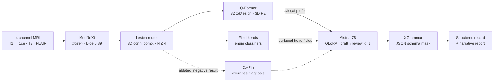

# NeuroFusion

**The Diagnosis a Reporter Leaves Unspoken: Surfacing Frozen Tumor Features for Brain-Tumor MRI Reporting**

[](https://arxiv.org/abs/2609.02411)
[](https://mlcnws.com/)
[](LICENSE)
[](requirements.txt)

Reference implementation for the MLCN 2026 paper. NeuroFusion turns a four-sequence brain MRI into a
single **schema-valid structured record plus a narrative report** in one decoder pass, by *surfacing*
discriminative field-head outputs to the language model instead of letting the decoder guess.

> **Paper:** Khawaja Murad ul Hassan, Ruqiyya Adil, Adil Qayyum, Rida Hassan, Asad Mansoor Khan,
> Muhammad Usman Akram, Mehran Ebrahimi. *The Diagnosis a Reporter Leaves Unspoken: Surfacing Frozen
> Tumor Features for Brain-Tumor MRI Reporting.* MLCN 2026 (MICCAI workshop), Springer LNCS — to appear.
> Preprint: **[arXiv:2609.02411](https://arxiv.org/abs/2609.02411)**

---

## The finding in one paragraph

A fluent brain-MRI reporter can be **diagnostically mute**. On held-out cohorts a multi-chain
chain-of-thought (CoT) reporter built on a medical Mistral-7B calls most meningiomas and *nearly every*
metastasis "glioma" — diagnosis recall **0.44 / 0.07**. The answer is not missing from the model: a
supervised linear probe recovers the three cohorts from its **frozen** segmentation features at
**0.82 macro-F1** (5-fold CV; chance ≈ 0.33). The diagnosis is linearly accessible yet never verbalized.
We call this **diagnostic suppression**, and the remedy is not a bigger model but a decoder *trained to
commit* to field-head outputs it already has.

## Method



**Trained:** lesion routing, the Q-Former, the field classifiers, and the LoRA adapter.
**Frozen:** the MedNeXt segmentation backbone and the base LM weights.

Two design choices carry the result:

1. **Head-surfacing.** Linear enum classifiers over pooled per-lesion Q-Former features predict the
   structured fields; their argmax is injected into the prompt *as text*. The **diagnosis is deliberately
   not a head** — the LM recovers it once the fields are surfaced.
2. **Committed conditioning, not mere availability.** A same-base CoT handed the *identical* head argmax
   as text still misreads the diagnosis. The gain requires a decoder trained to commit, which is why the
   single-pass draft-then-review decoder replaces the CoT.

## Results

### Same-base: NeuroFusion vs. the prior CoT on the identical Mistral backbone

GLI *n*=54 (twin-excluded), MEN/MET *n*=60. Δ is paired NeuroFusion − CoT, Holm-corrected across the
pre-specified 9-cell family. **8 wins, 0 losses, 1 ns.**

| Metric | Cohort | NeuroFusion | CoT | Δ | BCa 95% CI | Verdict |
|---|---|---|---|---|---|---|
| RaTEScore | GLI | 0.657 | 0.596 | +0.061 | [+0.034, +0.088] | **win** |
| RaTEScore | MEN | 0.661 | 0.544 | +0.117 | [+0.075, +0.160] | **win** *(primary endpoint)* |
| RaTEScore | MET | 0.596 | 0.500 | +0.096 | [+0.071, +0.121] | **win** |
| RadGraph-F1 | GLI | 0.272 | 0.226 | +0.045 | [+0.011, +0.081] | **win** |
| RadGraph-F1 | MEN | 0.258 | 0.194 | +0.064 | [+0.033, +0.100] | **win** |
| RadGraph-F1 | MET | 0.183 | 0.175 | +0.008 | [−0.015, +0.032] | ns |
| GREEN | GLI | 0.396 | 0.278 | +0.118 | [+0.063, +0.174] | **win** |
| GREEN | MEN | 0.422 | 0.306 | +0.116 | [+0.055, +0.179] | **win** |
| GREEN | MET | 0.267 | 0.209 | +0.058 | [+0.012, +0.103] | **win** |

**Diagnosis recall** (NeuroFusion / CoT): GLI 0.98 / 0.98 · MEN **0.92 / 0.44** · MET **0.75 / 0.07**.
Latency **≈73–89 s/case vs. 457 s** for the CoT (5–6× faster, A100; L4-deployable).

### Blinded two-neurologist reader study (9 cases, 3/cohort)

Mean of five 0–5 axes; independently rated, opaque labels A–F.

| System | GLI | MEN | MET | Critical errors | Sign-off |
|---|---|---|---|---|---|
| **NeuroFusion (ours)** | **4.47** | **4.00** | **3.47** | **0/9** | **8** |
| Prior-CoT (ours) | 2.87 | 1.00 | 3.27 | 4/9 | 0 |
| M3D-LaMed | 1.33 | 0.67 | 1.33 | 7/9 | 0 |
| LLaVA-Med | 2.13 | 1.00 | 1.40 | 7/9 | 1 |
| AutoRG-Brain | 0.60 | 1.13 | 0.40 | 8/9 | 0 |
| BrainGemma3D | n/a | 0.67 | 1.00 | 5/6 | 0 |

NeuroFusion is the only system with **zero critical errors** (Wilson 95% upper 0.34) and is rated highest
in every cohort. This is a **pilot**: descriptive means and counts, no *p*-values.

### A negative result we kept

A calibrated **DiagnosisHead that overrides the decoder backfires — 0 of 9 gains.** In distribution the
field-conditioned LM already out-diagnoses the head (GLI/MEN 0.98/0.92 vs. 0.85/0.77), and out of
distribution the head collapses from 0.75 → **0.03** (2/60) while the LM's diagnosis transfers.
*Surface the features and let the decoder speak; do not pin a frozen-feature classifier.*

### Audit layer

| Property | Value |
|---|---|
| Schema-valid records | **92.3%** (36/39; Wilson [0.80, 0.97]) — near zero without the grammar |
| Sentence-level contradictions | **7.5%** vs. 36.8% for direct generation |
| Expected calibration error (15-bin) | 0.128 → **0.095** after temperature scaling |
| Per-modality Shapley | edema → FLAIR (+0.165, 54% of that field); location → T1CE |

## Model weights

**Weights are not released at this time.** The repository is a code and method release. The trained
checkpoints depend on a base LM and corpora whose redistribution terms we are still working through, and
a deployment lineage decision is pending. Please open an issue or contact the corresponding author if you
need weights for academic evaluation.

## Repository layout

The modules import one another by bare name (`from schema import ...`), exactly as they ran for the
paper. That flat layout is preserved deliberately — repackaging into a namespace would silently change
the code that produced the reported numbers.

```
model.py                  Q-Former, field heads, lesion router, LM wiring, decoding config
qformer_custom.py         per-lesion Q-Former
mrope_4d.py               factorized 3D/4D positional encoding
mrope_patch.py            per-layer RoPE dispatch for the decoder
xgrammar_decoder.py       grammar-constrained JSON decoding
repetition_guard.py       decoding-time degeneracy guard
schema.py                 the structured report schema (pydantic)
enum_mappings.py          controlled vocabulary → enum normalization
dataset.py                report/volume dataset
bratscombined_dataset.py  multi-cohort BraTS-format loader
preprocess_reports.py     free-text → structured-field normalization
build_dataset.py          report curation from the study spreadsheet
dataset_augment.py        augmentation
train.py                  training entry point
eval.py                   evaluation: schema validity, per-field macro-F1, narrative metrics
eval_folds.py             cross-fold aggregation
predict.py                inference entry point
calibrate.py              temperature scaling on the calibration split

scripts/
  eval_narrative_rate.py       RaTEScore
  eval_narrative_radgraph.py   RadGraph-F1
  eval_narrative.py            narrative metric driver
  bootstrap_significance.py    paired BCa bootstrap + Holm correction
  analyze_reader_study.py      reader-study aggregation (Table 4)
  aggregate_opus_judge.py      blinded clinical rubric (Clin-O)
  verbalizer_faithfulness.py   per-sentence entailment / contradiction rate
  faithfulness_v3.py           faithfulness scoring
  cot_prompts.py               the multi-chain CoT baseline prompts
  confound_probe.py            confound / leakage probing
  nfdx_struct_latency.py       latency measurement

docs/
  DATA.md              data provenance, licences, splits, deduplication
  ETHICS.md            ethics posture, reader study, clinical-pilot scope, IRB status
  MODEL_CARD.md        intended use, limitations, failure modes
  REPRODUCIBILITY.md   how each reported number is produced
```

## Installation

```bash
git clone https://github.com/Khawaja-Murad/neurofusion-code.git
cd neurofusion-code
python -m venv .venv && source .venv/bin/activate
pip install -r requirements.txt
```

Python 3.11, CUDA-capable GPU. Training and full evaluation were run on NVIDIA A100s; inference is
L4-deployable.

The base LM path is environment-driven:

```bash
export NF_MISTRAL_BASE=/path/to/llava-med-v1.5-mistral-7b   # base decoder weights
export NF_REPO=$PWD                                          # repo root, used by scripts/
export NF_PRED_DIR=$PWD/predictions                          # where prediction JSONLs live
```

## Usage

```bash
# inference: 4-channel BraTS-format volume -> structured record + narrative
python predict.py --checkpoint <ckpt> --input <case_dir> --out predictions/test.jsonl

# evaluation: schema validity, per-field macro-F1, narrative metrics
python eval.py --predictions predictions/test.jsonl --split test

# significance: paired BCa bootstrap with Holm correction over the pre-specified family
python scripts/bootstrap_significance.py --a predictions/nf.jsonl --b predictions/cot.jsonl
```

See [docs/REPRODUCIBILITY.md](docs/REPRODUCIBILITY.md) for the pipeline stage by stage.

## Data

All imaging is **public data under its original licences** — BraTS-2020, RadGenome, and BraTS-MET.
No new patient data were collected for this paper, and no ethics approval beyond the source datasets'
own was required. The 121 human-authored structured reports were written by the study team and will be
released once curation is complete; they are **not** in this repository.

Full detail — cohorts, splits, deduplication, and what is and is not redistributable — is in
[docs/DATA.md](docs/DATA.md). Ethics posture and the scope of the planned clinical evaluation are in
[docs/ETHICS.md](docs/ETHICS.md).

## Limitations

Stated plainly, as in the paper:

- The in-distribution test set is **small** (*n*=39). Same-base gains rest on 174 pooled held-out cases.
- Only metastasis is out-of-distribution **for the reporter** — the segmenter is metastasis-fine-tuned.
- Geometric completeness is **bounded by the segmentation** (met-FT Dice 0.67); empty masks route to
  human review. NeuroFusion is an **assistive draft tool**, not an autonomous diagnostic system.
- The reader study is a **single-institution pilot**: two neurologists, nine cases, no *p*-values.
  A neuroradiologist panel and a multi-site study are future work.
- The 121 reports lack formal inter-annotator agreement.
- GREEN and the clinical rubric are LLM-scored; the judge-free metrics (RaTEScore, RadGraph-F1) carry
  the claim.

## Citation

```bibtex
@inproceedings{hassan2026neurofusion,
  title     = {The Diagnosis a Reporter Leaves Unspoken: Surfacing Frozen Tumor
               Features for Brain-Tumor {MRI} Reporting},
  author    = {Hassan, Khawaja Murad ul and Adil, Ruqiyya and Qayyum, Adil and
               Hassan, Rida and Khan, Asad Mansoor and Akram, Muhammad Usman and
               Ebrahimi, Mehran},
  booktitle = {Machine Learning in Clinical Neuroimaging (MLCN), MICCAI Workshop},
  series    = {Lecture Notes in Computer Science},
  publisher = {Springer},
  year      = {2026},
  note      = {arXiv:2609.02411}
}
```

## License

Code is released under the [Apache License 2.0](LICENSE). The datasets retain their own licences —
see [docs/DATA.md](docs/DATA.md). No model weights are distributed in this repository.

## Acknowledgements

Supported in part by an NSERC Discovery Grant to Mehran Ebrahimi. Khawaja Murad ul Hassan thanks Mitacs
for the Globalink Research Internship at Ontario Tech University.

## Contact

Khawaja Murad ul Hassan — <khawajamurad@outlook.com>
National University of Sciences and Technology, Islamabad, Pakistan
